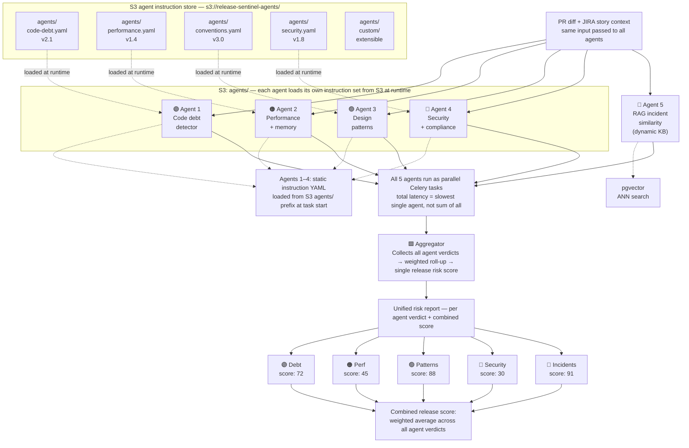
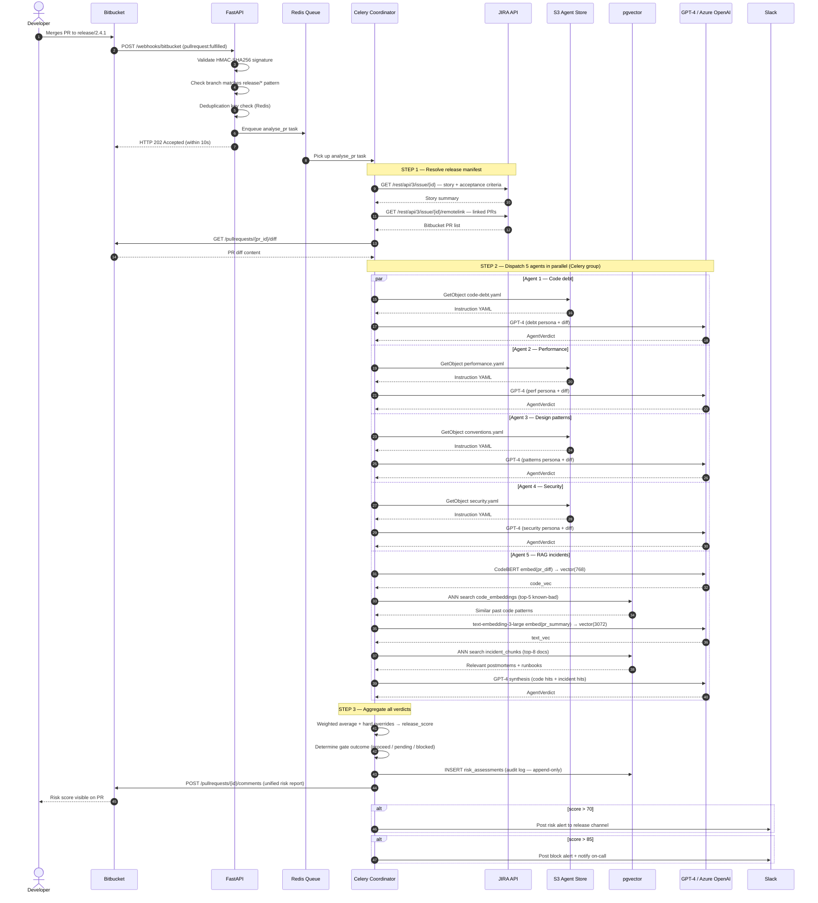
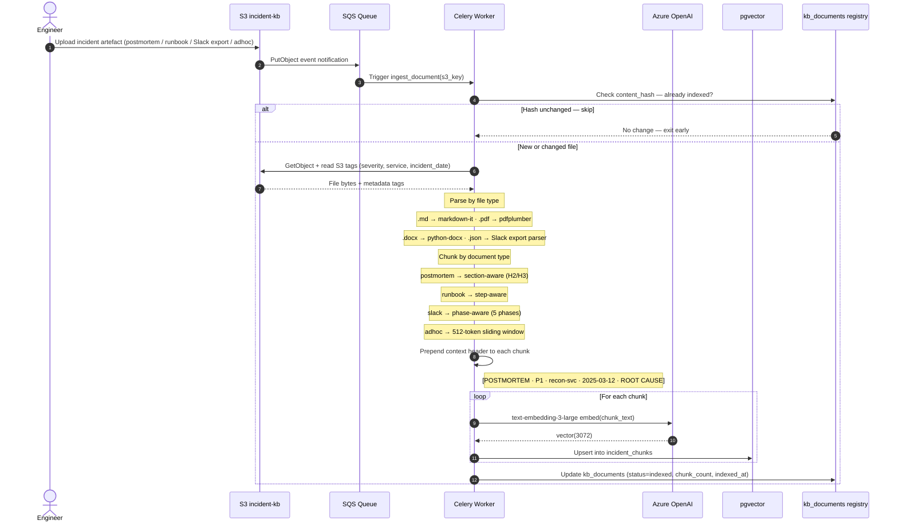

# Release Sentinel — Workflow Design

**Document:** Post-Trigger Workflow  
**Project:** Release Sentinel — AI-Powered Release Risk Governance System  
**Version:** 2.0  
**Date:** April 2026  
**Status:** Design Review  
**Prepared by:** AI Innovation Team  
**Version:** 2.1  
**Change from v2.0:** Mermaid flowchart added to Section 6 (multi-agent pipeline diagram). ASCII sequence diagrams in Section 9 replaced with Mermaid sequence diagrams for both Flow A and Flow B.  
**Change from v1.0:** Step 2 replaced with multi-agent evaluation pipeline. Single GPT-4 synthesis replaced by five specialist agents running in parallel as Celery tasks. S3 agent instruction store added. Aggregator layer added.

**Scope:** This document covers the workflow that executes after Trigger 1 fires (Bitbucket PR merge). It covers the two integration flows (Flow A and Flow B), the three-step analysis pipeline, the multi-agent evaluation design, and the dual embedding strategy that powers the RAG agent.

---

## Table of Contents

1. [Overview — What Happens After the Trigger Fires](#1-overview--what-happens-after-the-trigger-fires)
2. [Two Parallel Flows](#2-two-parallel-flows)
3. [Flow A — Real-Time Webhook Push (PR Analysis)](#3-flow-a--real-time-webhook-push-pr-analysis)
4. [Flow B — Batch API Pull (Knowledge Base Ingestion)](#4-flow-b--batch-api-pull-knowledge-base-ingestion)
5. [Step 1 — Resolve Release Manifest from JIRA (Role A)](#5-step-1--resolve-release-manifest-from-jira-role-a)
6. [Step 2 — Multi-Agent Evaluation Pipeline](#6-step-2--multi-agent-evaluation-pipeline)
7. [Step 3 — Aggregation and Risk Report Output](#7-step-3--aggregation-and-risk-report-output)
8. [The Dual Embedding Strategy](#8-the-dual-embedding-strategy)
9. [End-to-End Sequence Diagram](#9-end-to-end-sequence-diagram)

---

## 1. Overview — What Happens After the Trigger Fires

When Trigger 1 fires (a PR is merged into the release branch in Bitbucket), Release Sentinel begins a structured three-step workflow. The purpose of this workflow is to answer one question:

> **Does the code being shipped in this release introduce risk — either by resembling past incidents, or by violating known quality, performance, security, or design standards?**

The subject of analysis is always the **feature being shipped** — the JIRA stories and their linked PRs. Two knowledge sources are searched:

- **Role A — JIRA:** The release manifest — what features and stories are in scope, which PRs are attached, what code is being shipped
- **Role B — S3:** Two stores in S3 — the incident knowledge base (postmortems, runbooks, Slack exports) and the agent instruction store (static checklists and code patterns per evaluation dimension)

This is the critical distinction: JIRA stories are the *input* (what is being released). S3 is the *knowledge* (what broke before, and what to check for).

```
TRIGGER FIRES (Bitbucket PR merged to release branch)
        │
        ▼
┌───────────────────────────────────────────────────────────────────┐
│  STEP 1 — Resolve release manifest from JIRA (Role A)             │
│  What stories/epics are in this release?                          │
│  Which PRs are attached? What code is actually being shipped?     │
└────────────────────────────┬──────────────────────────────────────┘
                             │
                             ▼
┌───────────────────────────────────────────────────────────────────┐
│  STEP 2 — Multi-agent evaluation pipeline (Role B)                │
│  Five specialist agents run in parallel as Celery tasks           │
│  Each agent evaluates the PR diff in isolation                    │
│  Agents 1–4: static instructions loaded from S3 agents/ store    │
│  Agent 5:    RAG similarity against S3 incident knowledge base    │
└────────────────────────────┬──────────────────────────────────────┘
                             │
                             ▼
┌───────────────────────────────────────────────────────────────────┐
│  STEP 3 — Aggregation and risk report output                      │
│  Aggregator collects all five agent verdicts                      │
│  Weighted roll-up → single release risk score                     │
│  Per-agent breakdown + unified report posted to PR + dashboard    │
└───────────────────────────────────────────────────────────────────┘
```

---

## 2. Two Parallel Flows

The workflow operates across two distinct integration flows that run independently of each other.

```
┌──────────────────────────────────────────────────────────────────────┐
│  FLOW A — Real-time webhook push                                      │
│  Trigger: Bitbucket PR merged                                         │
│  Purpose: Analyse the incoming code change against both knowledge     │
│           bases — agent instruction store + incident KB               │
│  Mode:    Asynchronous — triggered on every PR merge                  │
│  Latency: Under 30 seconds end-to-end                                 │
└──────────────────────────────────────────────────────────────────────┘

┌──────────────────────────────────────────────────────────────────────┐
│  FLOW B — Batch knowledge base ingestion                              │
│  Trigger: S3 PutObject event (new incident document uploaded)         │
│  Purpose: Ingest new incident artefacts into the RAG knowledge base   │
│           Agent instruction files are loaded fresh per task — no      │
│           separate ingestion needed for agent YAMLs                   │
│  Mode:    Asynchronous — triggered on S3 upload, or scheduled nightly │
│  Latency: Under 5 minutes from upload to indexed                      │
└──────────────────────────────────────────────────────────────────────┘
```

Flow A consumes both knowledge bases that Flow B and the agent instruction store maintain. The two flows are fully decoupled — Flow B runs in the background regardless of whether any release is being analysed.

---

## 3. Flow A — Real-Time Webhook Push (PR Analysis)

Flow A is the primary analysis pipeline. It runs every time a PR is merged to the release branch.

### Sequence

```
Bitbucket fires webhook (pullrequest:fulfilled / pr:merged)
        │
        ▼
FastAPI /webhooks/bitbucket endpoint
  ├── Validate HMAC-SHA256 signature
  ├── Filter: merged PR to watched release branch only
  ├── Deduplicate (idempotency key in Redis)
  └── Return HTTP 202 immediately
        │
        ▼
Celery task enqueued: analyse_pr(pr_id, repo, branch, jira_story, commit_sha)
        │
        ▼
STEP 1: Resolve release manifest from JIRA
  ├── Identify JIRA story from PR title ([PROJ-456] convention)
  ├── Fetch story details + acceptance criteria from JIRA API
  ├── Resolve all PRs in the same fix version / epic
  └── Fetch diff for each PR from Bitbucket REST API
        │
        ▼
STEP 2: Multi-agent evaluation pipeline (5 parallel Celery tasks)
  ├── Agent 1: Code debt detector      (static instructions from S3)
  ├── Agent 2: Performance + memory    (static instructions from S3)
  ├── Agent 3: Design patterns         (static instructions from S3)
  ├── Agent 4: Security + compliance   (static instructions from S3)
  └── Agent 5: RAG incident similarity (dynamic — pgvector ANN search)
        │
        ▼
STEP 3: Aggregation and output
  ├── Aggregator collects all 5 verdicts → weighted risk score
  ├── Post unified risk report as Bitbucket PR comment
  ├── Store risk assessment in risk_assessments table (audit log)
  ├── If score > 70 → Slack notification to release channel
  └── If score > 85 → alert on-call + block Jenkins gate
```

### Bitbucket REST API calls in Flow A

```
# Fetch PR diff (after webhook received)
GET /2.0/repositories/{workspace}/{slug}/pullrequests/{pr_id}/diff          # Cloud
GET /rest/api/1.0/projects/{key}/repos/{slug}/pull-requests/{pr_id}/diff    # Server

# Fetch list of changed files
GET /2.0/repositories/{workspace}/{slug}/pullrequests/{pr_id}/diffstat      # Cloud
GET /rest/api/1.0/projects/{key}/repos/{slug}/pull-requests/{pr_id}/changes # Server

# Post unified risk report as PR comment
POST /2.0/repositories/{workspace}/{slug}/pullrequests/{pr_id}/comments     # Cloud
POST /rest/api/1.0/projects/{key}/repos/{slug}/pull-requests/{pr_id}/comments # Server
```

### JIRA REST API calls in Flow A

```
# Fetch story details linked to the PR
GET /rest/api/3/issue/{issueId}
  ?fields=summary,description,status,assignee,fixVersions,customfield_acceptance_criteria

# Fetch all stories in the same fix version (for full release context)
GET /rest/api/3/search
  ?jql=fixVersion="release-2.4.1" AND issuetype in (Story, Task, Bug)
  &fields=summary,description,status,assignee

# Fetch linked Bitbucket PRs per story
GET /rest/api/3/issue/{issueId}/remotelink
```

---

## 4. Flow B — Batch Knowledge Base Ingestion

Flow B keeps the RAG incident knowledge base current. It is completely decoupled from Flow A.

### What triggers Flow B

```
Engineer uploads incident artefact to S3 incident KB bucket
  └── postmortems/reconciliation-rca-2025-03.md
  └── slack-exports/incident-2025-03-12.json
  └── runbooks/recon-service-runbook.yaml
  └── adhoc/email-thread-nav-incident.eml
        │
        ▼
S3 PutObject event → SQS queue → Celery worker: ingest_document(s3_key)
```

**Note on agent instruction files:** Agent instruction YAMLs live in a separate S3 prefix (`s3://release-sentinel-agents/`). These are **not** ingested into pgvector — they are loaded fresh by each agent Celery task at runtime via a direct S3 `GetObject` call. No embedding or indexing is needed for them.

### Ingestion pipeline sequence (incident KB only)

```
Celery task: ingest_document(s3_key)
        │
        ▼
1. Check kb_documents registry
   └── Compute SHA-256 hash of file content
   └── If hash unchanged → skip (no re-embedding needed)
   └── If new or changed → proceed
        │
        ▼
2. Download file from S3
   └── Read S3 object tags: severity, service, incident_date, linked_pr
        │
        ▼
3. Parse by file type
   ├── .md / .html  → markdown-it / beautifulsoup4
   ├── .pdf         → pdfplumber
   ├── .docx        → python-docx
   ├── .yaml        → PyYAML
   ├── .json        → json.loads() (Slack export format)
   └── .eml / .txt  → email stdlib / open()
        │
        ▼
4. Chunk by document type strategy
   ├── postmortems/   → section-aware chunking (H2/H3 heading boundaries)
   ├── runbooks/      → step-aware chunking (numbered steps / top-level keys)
   ├── slack-exports/ → phase-aware chunking (5 incident phases)
   └── adhoc/         → 512-token sliding window, 64-token overlap
        │
        ▼
5. Prepend context header to every chunk
   └── [POSTMORTEM · P1 · reconciliation-service · 2025-03-12 · ROOT CAUSE]
        │
        ▼
6. Embed each chunk
   └── text-embedding-3-large (Azure OpenAI) → vector(3072)
   └── Upsert into incident_chunks table (pgvector)
        │
        ▼
7. Update kb_documents registry
   └── status = indexed, chunk_count, total_tokens, indexed_at
```

### S3 bucket layout — two separate stores

```
s3://release-sentinel-incident-kb/       ← incident knowledge base (Flow B)
├── postmortems/
├── runbooks/
├── slack-exports/
└── adhoc/

s3://release-sentinel-agents/            ← agent instruction store (loaded at runtime)
├── code-debt.yaml
├── performance.yaml
├── conventions.yaml
├── security.yaml
└── custom/                              ← extensible — add new agents here
```

---

## 5. Step 1 — Resolve Release Manifest from JIRA (Role A)

### What Role A means

JIRA's role is **input only** — it tells Release Sentinel what features are being shipped. The release manifest contains:

- Which JIRA stories and epics are in scope for this release
- Which Bitbucket PRs are linked to each story
- Acceptance criteria (used to identify missing test coverage gaps)
- Which services are affected (used to scope the pgvector search in Agent 5)

### How the manifest is resolved

```
Release manager provides one of:
  ├── JIRA fix version:  "release-2.4.1"
  ├── JIRA epic ID:      "PROJ-400"
  └── JIRA sprint ID:    "Sprint 42"
        │
        ▼
Query JIRA for all stories in scope:
  GET /rest/api/3/search
  ?jql=fixVersion="release-2.4.1" AND issuetype in (Story, Task, Bug)
  &fields=summary,description,status,assignee,fixVersions
        │
        ▼
For each story — resolve linked Bitbucket PRs:
  Method 1: GET /rest/api/3/issue/{issueId}/remotelink   (JIRA-Bitbucket integration)
  Method 2: Search Bitbucket for PRs with [PROJ-NNN] in title  (fallback)
        │
        ▼
For each PR — fetch code diff from Bitbucket:
  GET /2.0/repositories/{workspace}/{slug}/pullrequests/{pr_id}/diff   (Cloud)
  GET /rest/api/1.0/projects/{key}/repos/{slug}/pull-requests/{id}/diff (Server)
        │
        ▼
Aggregate full code change surface for the release:
  ├── All modified files across all PRs
  ├── All diff hunks and function-level changes
  ├── All affected services (derived from repo + file paths)
  └── All JIRA story summaries and acceptance criteria
```

### Release manifest dataclass

```python
@dataclass
class ReleaseManifest:
    release_id:    str
    stories:       list[JiraStory]
    prs:           list[PullRequest]
    services:      list[str]
    file_paths:    list[str]
    total_hunks:   int
    requested_by:  str

@dataclass
class JiraStory:
    id:                  str
    summary:             str
    acceptance_criteria: str
    linked_prs:          list[str]

@dataclass
class PullRequest:
    id:          str
    title:       str
    jira_story:  str
    diff_chunks: list[DiffChunk]
    file_paths:  list[str]
    commit_sha:  str
```

This manifest is passed as the shared input to all five agents in Step 2.

---

## 6. Step 2 — Multi-Agent Evaluation Pipeline

### Why multiple agents instead of one GPT-4 call

A single prompt trying to check for code debt, performance issues, design patterns, security violations, and incident similarity simultaneously produces three failure modes:

- **Context bloat** — the model spends attention on irrelevant parts of a large prompt
- **Diluted focus** — competing instructions cause the model to check for everything superficially and catch nothing well
- **Hallucination drift** — long context with conflicting instructions causes hedging, contradiction, and fabrication

Five specialist agents with narrow, focused personas solve all three problems. Each agent receives a small, high-signal context window containing only the PR diff, its JIRA story, and its own specific instruction set. It returns a verdict in its domain only.

### Agent overview

| Agent | Persona | Instruction source | Celery task |
|-------|---------|-------------------|-------------|
| 1 — Code debt detector | Identifies shortcuts, TODOs, commented-out code, copy-paste patterns, missing abstractions introduced by the PR | `s3://release-sentinel-agents/code-debt.yaml` | `run_agent_task` |
| 2 — Performance + memory | Checks for N+1 queries, unbounded loops, missing pagination, memory leaks, inefficient data structures | `s3://release-sentinel-agents/performance.yaml` | `run_agent_task` |
| 3 — Design patterns + conventions | Detects deviations from established architecture, naming conventions, layering violations, anti-patterns | `s3://release-sentinel-agents/conventions.yaml` | `run_agent_task` |
| 4 — Security + compliance | Flags hardcoded secrets, unvalidated inputs, SQL injection risk, missing auth checks, PII exposure | `s3://release-sentinel-agents/security.yaml` | `run_agent_task` |
| 5 — RAG incident similarity | Embeds the diff with CodeBERT, searches pgvector for similar past code that caused incidents | Dynamic — pgvector ANN search | `run_rag_agent_task` |

### Multi-agent pipeline diagram



### Execution model — parallel Celery tasks

All five agents are dispatched simultaneously using a Celery group. Total latency equals the slowest single agent, not the sum of all five.

```python
from celery import group
from app.tasks import run_agent_task, run_rag_agent_task

def dispatch_agents(manifest: ReleaseManifest, pr: PullRequest) -> list[AgentVerdict]:
    """
    Dispatch all 5 agents in parallel for a single PR.
    Celery group runs all tasks simultaneously.
    Results are collected once all tasks complete.
    """
    static_agents = ["code-debt", "performance", "conventions", "security"]

    task_group = group(
        # Agents 1–4: static instruction files from S3
        *[
            run_agent_task.s(
                agent_name   = agent,
                pr_diff      = pr.diff_chunks,
                jira_story   = manifest.stories,
                pr_title     = pr.title,
                file_paths   = pr.file_paths,
            )
            for agent in static_agents
        ],
        # Agent 5: RAG similarity — dynamic pgvector search
        run_rag_agent_task.s(
            pr_diff      = pr.diff_chunks,
            pr_summary   = pr.title,
            services     = manifest.services,
        ),
    )

    # Block until all agents return (with timeout)
    results = task_group.apply_async()
    return results.get(timeout=60)
```

### Agent 1–4 — static instruction task

Each static agent loads its instruction YAML from S3 at runtime, builds a focused prompt, and calls GPT-4:

```python
@celery_app.task(name="run_agent_task")
async def run_agent_task(
    agent_name: str,
    pr_diff:    list[DiffChunk],
    jira_story: list[JiraStory],
    pr_title:   str,
    file_paths: list[str],
) -> AgentVerdict:
    """
    Load agent instructions from S3, build prompt, call GPT-4.
    Each agent evaluates the PR diff in complete isolation.
    """
    # Load instruction YAML fresh from S3 — no caching
    # This ensures the latest instruction version is always used
    instructions = await s3.get_object(
        bucket = "release-sentinel-agents",
        key    = f"{agent_name}.yaml",
    )

    prompt = f"""
{instructions['system_prompt']}

## PR being evaluated
Title:      {pr_title}
Files:      {', '.join(file_paths)}
JIRA story: {jira_story[0].summary if jira_story else 'unknown'}

## Code diff
{format_diff(pr_diff, max_tokens=2000)}

## Your task
{instructions['evaluation_task']}

Respond ONLY with a JSON object:
{{
  "score":           <0-100>,
  "verdict":         "<pass|warn|fail>",
  "findings":        [list of specific issues found],
  "recommendations": [list of actionable fixes],
  "summary":         "<one paragraph>"
}}
"""

    response = await gpt4(prompt, response_format="json")
    return AgentVerdict(
        agent      = agent_name,
        score      = response["score"],
        verdict    = response["verdict"],
        findings   = response["findings"],
        recommendations = response["recommendations"],
        summary    = response["summary"],
    )
```

### Agent 5 — RAG incident similarity task

Agent 5 is architecturally different from Agents 1–4. Instead of loading static instructions, it performs a live vector search against the incident knowledge base using the dual embedding strategy:

```python
@celery_app.task(name="run_rag_agent_task")
async def run_rag_agent_task(
    pr_diff:    list[DiffChunk],
    pr_summary: str,
    services:   list[str],
) -> AgentVerdict:
    """
    Dual embedding search: CodeBERT for code patterns,
    text-embedding-3-large for incident documents.
    Both searches run in parallel.
    """
    # Embed in parallel — see Section 8 for full detail
    code_hits, incident_hits = await retrieve_context(
        pr_diff    = pr_diff,
        pr_summary = pr_summary,
        services   = services,
    )

    # Apply recency decay before passing to GPT-4
    code_hits     = apply_recency_decay(code_hits)
    incident_hits = apply_recency_decay(incident_hits)

    prompt = f"""
You are a release risk analyst evaluating whether this PR resembles
code that has caused production incidents before.

## PR being evaluated
{pr_summary}

## Similar past code patterns (from code_embeddings — known-bad PRs)
{format_code_hits(code_hits, top_k=5)}

## Related incident documents (from incident_chunks — postmortems, runbooks)
{format_incident_hits(incident_hits, top_k=8)}

Respond ONLY with a JSON object:
{{
  "score":           <0-100>,
  "verdict":         "<pass|warn|fail>",
  "findings":        [specific incident references with similarity scores],
  "recommendations": [actionable steps before deploying],
  "summary":         "<one paragraph>"
}}

A score above 70 must be justified by at least one named incident or PR reference.
"""

    response = await gpt4(prompt, response_format="json")
    return AgentVerdict(
        agent      = "rag-incidents",
        score      = response["score"],
        verdict    = response["verdict"],
        findings   = response["findings"],
        recommendations = response["recommendations"],
        summary    = response["summary"],
    )
```

### Agent instruction YAML structure

Each agent in S3 follows a standard schema. This allows tech leads to update checklist rules without touching application code:

```yaml
# s3://release-sentinel-agents/code-debt.yaml
version: "2.1"
agent_name: code-debt-detector
description: Identifies technical debt introduced by a PR

system_prompt: |
  You are a senior engineer specialising in code quality and technical debt.
  Your sole job is to evaluate whether the PR diff introduces any code debt.
  Do not comment on security, performance, or design patterns — those are
  handled by other agents. Focus only on debt indicators.

evaluation_task: |
  Check the diff for the following debt signals:
  - TODO / FIXME / HACK comments added without a linked ticket
  - Copy-paste duplication — same logic appearing more than once
  - Magic numbers or hardcoded strings that should be constants
  - Methods longer than 40 lines without justification
  - Commented-out code left in the diff
  - Missing error handling on new code paths
  - Abstractions bypassed in favour of quick fixes

  For each finding, state:
  - The exact file and line number
  - Why it constitutes debt
  - The recommended fix

weight: 0.15          # contribution to the aggregated release score
severity_override:    # if any of these are found, minimum score floor
  - pattern: "TODO without ticket"
    min_score: 40
  - pattern: "commented-out code"
    min_score: 30
```

### Agent weights — aggregator configuration

```python
# Weights reflect the relative risk impact of each dimension
AGENT_WEIGHTS = {
    "code-debt":    0.15,
    "performance":  0.20,
    "conventions":  0.15,
    "security":     0.25,   # highest — security failures block releases
    "rag-incidents": 0.25,  # highest — proven past failures are the strongest signal
}
```

Weights are configurable in the agent YAML. A critical security flag can be configured to override the aggregated score entirely rather than just contributing to a weighted average.

---

## 7. Step 3 — Aggregation and Risk Report Output

### Aggregator

Once all five agent tasks complete, the aggregator collects their verdicts and computes a single release-level score:

```python
from dataclasses import dataclass

@dataclass
class AgentVerdict:
    agent:           str
    score:           int          # 0–100
    verdict:         str          # pass | warn | fail
    findings:        list[str]
    recommendations: list[str]
    summary:         str

def aggregate_verdicts(verdicts: list[AgentVerdict]) -> AggregatedResult:
    """
    Weighted average across all agent scores.
    A single high-scoring security or incident agent
    dominates the final score as intended.
    """
    verdict_map  = {v.agent: v for v in verdicts}
    weighted_sum = sum(
        verdict_map[agent].score * weight
        for agent, weight in AGENT_WEIGHTS.items()
        if agent in verdict_map
    )
    release_score = round(weighted_sum)

    # Hard override: if security or RAG agent returns fail, minimum score is 75
    if any(
        v.verdict == "fail" and v.agent in ("security", "rag-incidents")
        for v in verdicts
    ):
        release_score = max(release_score, 75)

    return AggregatedResult(
        release_score = release_score,
        verdicts      = verdicts,
        gate_outcome  = determine_gate(release_score),
    )

def determine_gate(score: int) -> str:
    if score >= 85: return "blocked"
    if score >= 70: return "vp_approval_required"
    return "auto_proceed"
```

### Output surface 1 — Bitbucket PR comment

Posted within 30 seconds of the PR merge. Shows the per-agent breakdown so the developer knows exactly which dimension flagged and why.

```markdown
## ⚠️ Release Sentinel — Risk Score: 78 / 100

**Gate:** VP approval required before this release proceeds to production.

### Agent verdicts

| Agent | Score | Verdict | Top finding |
|-------|-------|---------|------------|
| Code debt | 72 | ⚠️ warn | TODO without ticket in reconciliation_engine.py:L44 |
| Performance | 45 | ✅ pass | No significant performance issues detected |
| Design patterns | 88 | 🔴 fail | Service layer calling repository directly — bypasses domain layer |
| Security | 30 | ✅ pass | No security issues detected |
| Incident similarity | 91 | 🔴 fail | Similar to PR #4821 — auto_resolve() without null guard, caused REC-8901 |

### Top recommendations
1. Add null guard for trade_id before calling auto_resolve() — see PR #4830 for fix pattern
2. Route repository calls through the domain service layer
3. Link the TODO on line 44 to a JIRA ticket before merging

[View full report →](https://release-sentinel.internal/reports/pr-4821)
```

### Output surface 2 — Release Sentinel dashboard (per release)

Shows the full release picture with per-story and per-agent breakdown:

```
Release: release-2.4.1
Overall risk score: 62 / 100   ← weighted roll-up across all PRs and all agents
Gate outcome: VP approval required

Per-story breakdown:
┌──────────────────────────────────┬───────┬───────────┬──────┬──────┬──────┬──────────┐
│ JIRA Story                       │ Total │ Debt      │ Perf │ Conv │ Sec  │ Incidents│
├──────────────────────────────────┼───────┼───────────┼──────┼──────┼──────┼──────────┤
│ PROJ-456 · Auto-resolve handler  │  78   │  72 ⚠️    │  45  │  88  │  30  │  91 🔴   │
│ PROJ-457 · NAV fee calculation   │  55   │  30 ✅    │  65  │  45  │  40  │  72 ⚠️   │
│ PROJ-458 · Schema migration      │  42   │  50 ⚠️    │  35  │  40  │  30  │  45      │
│ PROJ-459 · UI dashboard          │  12   │  15 ✅    │  10  │  12  │  10  │  10 ✅   │
└──────────────────────────────────┴───────┴───────────┴──────┴──────┴──────┴──────────┘
```

### Output surface 3 — Slack notification

```
⚠️ Release Sentinel Alert — release-2.4.1

Overall risk score: 62/100 — VP approval required before deployment.

Highest risk: PROJ-456 (78/100)
  🔴 Incident similarity: 91 — similar to REC-8901
  🔴 Design patterns: 88 — service layer violation

[View full report] [Approve release] [Request remediation]
```

### Governance gate decision

| Release score | Gate outcome | Action |
|---------------|-------------|--------|
| 0–70 | `auto_proceed` | Deployment continues. Report posted. |
| 70–85 | `vp_approval_required` | Slack approval request sent. Jenkins pauses. |
| 85–100 | `blocked` | Jenkins halted. On-call notified. Release manager alerted. |

### Audit trail

Every risk assessment — full agent verdicts, individual scores, aggregated score, gate outcome, approver, timestamp — is written to the `risk_assessments` table as an append-only record retained for 7 years.

---

## 8. The Dual Embedding Strategy

The dual embedding strategy powers Agent 5 (RAG incident similarity). It is the design decision that makes the incident search genuinely precise.

### Why two models instead of one

Code diffs and incident documents live in completely different semantic spaces:

```
PROBLEM WITH ONE MODEL:

  General text model sees:
    "auto_resolve(txn)"  vs  "process_breaks(items)"
    → Different words → low similarity → bug MISSED

  CodeBERT sees:
    Loop + condition check + unguarded call → same structure
    → High similarity (0.91) → bug CAUGHT

  CodeBERT on postmortem prose:
    "The auto-resolution function silently swallowed null values..."
    → Treats as code tokens → poor semantic understanding → doc MISSED

  text-embedding-3-large on postmortem prose:
    Understands causal language, narrative, technical descriptions
    → High similarity to story summary → relevant doc SURFACED
```

### Model 1 — CodeBERT for code diffs

| Property | Value |
|----------|-------|
| Model | `microsoft/codebert-base` |
| Dimensions | 768 |
| pgvector table | `code_embeddings` |
| Input | Raw diff hunks, function bodies, modified file contents |
| Trained on | 6 million code + documentation pairs across Python, Java, JS, Go, PHP, Ruby |
| Key strength | Understands code structure — syntax, control flow, variable naming, function signatures |
| Hosted | Self-hosted on GPU node in AKS |

### Model 2 — text-embedding-3-large for incident documents

| Property | Value |
|----------|-------|
| Model | `text-embedding-3-large` (Azure OpenAI) |
| Dimensions | 3072 |
| pgvector table | `incident_chunks` |
| Input | Postmortem sections, runbook steps, Slack phase chunks, adhoc notes |
| Key strength | Deep semantic understanding of narrative prose, causal language, technical descriptions |
| Hosted | Azure OpenAI — managed, no GPU needed |

### Query-time dual retrieval — both searches run in parallel

```python
import asyncio
from datetime import datetime
from app.embeddings import embed_code, embed_text
from app.search import search_code_embeddings, search_incident_chunks

async def retrieve_context(
    pr_diff:    list[DiffChunk],
    pr_summary: str,
    services:   list[str],
) -> tuple[list, list]:
    """
    Used exclusively by Agent 5 (RAG incident similarity).
    Both embedding + search operations run in parallel via asyncio.gather.
    Total latency = max(code_search_time, incident_search_time).
    """
    code_vec, text_vec = await asyncio.gather(
        embed_code(pr_diff),       # CodeBERT → vector(768)
        embed_text(pr_summary),    # text-embedding-3-large → vector(3072)
    )

    code_hits, incident_hits = await asyncio.gather(
        search_code_embeddings(
            query_vec = code_vec,
            repo      = pr_diff[0].repo if pr_diff else "",
            top_k     = 5,
        ),
        search_incident_chunks(
            query_vec = text_vec,
            services  = services,
            top_k     = 8,
        ),
    )

    return code_hits, incident_hits


def apply_recency_decay(hits: list, half_life_days: int = 180) -> list:
    """
    Weight recent incidents more heavily than older ones.
    Score halves every 6 months.
    """
    for hit in hits:
        age_days  = (datetime.utcnow() - hit.incident_date).days
        decay     = 0.5 ** (age_days / half_life_days)
        hit.score = hit.similarity_score * decay
    return sorted(hits, key=lambda h: h.score, reverse=True)
```

### Why the dual signal matters for Agent 5

Agent 5 receives both result sets simultaneously. This means it can reason across two independent dimensions of evidence:

- Code pattern signal: "This PR's loop structure is 91% similar to PR #4821 which caused REC-8901"
- Incident document signal: "The postmortem for REC-8901 confirms this exact pattern causes NAV breaks"

Either signal alone is weaker. Both together — code pattern match plus documented outcome — give GPT-4 the evidence to produce a specific, auditable, high-confidence verdict rather than a vague warning.

---

## 9. End-to-End Sequence Diagram

### Flow A — Real-time PR analysis



---

### Flow B — Knowledge base ingestion

Flow B runs continuously in the background, fully independent of Flow A.



---

*Document maintained by the AI Innovation Team. Version 2.1.*  
*Agent instruction YAML schema, S3 agent store design, and per-agent prompt engineering are covered in `Agents.md`.*  
*pgvector schema, chunking strategy, and embedding implementation are covered in a separate design document.*